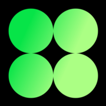

  

<h1 align="center">Ön Yüz Geliştirici · Web Tasarımcısı</h1>

<h2 align="center">Hakkımda</h2>

  Ben Furkan Akpınar; <strong>web tasarımı ve ön yüz geliştirme</strong> becerilerini bir araya getirerek markalara özgü dijital deneyimler oluşturuyorum.
  HTML, CSS, JavaScript ve TypeScript temelimle <strong>React ve Next.js üzerinde yeniden kullanılabilir, bakımı kolay arayüzler</strong> geliştiriyorum.
  Tipografi, görsel hiyerarşi ve etkileşim tasarımını; mobil, tablet ve masaüstünde tutarlı çalışan kullanıcı deneyimlerine dönüştürüyorum.
  Çok sayfalı portföyler, filtrelenebilir kataloglar, karşılaştırma ekranları ve çok adımlı formlar gibi farklı ihtiyaçlara yönelik çözümler üretiyorum.
  <strong>Erişilebilirlik, performans ve test</strong> konularını geliştirme sürecine dahil ediyor, temel kullanıcı akışlarını tarayıcı kontrolleri ve uygun projelerde Playwright ile doğruluyorum.
  Git ve GitHub ile sürüm kontrolünden Cloudflare Workers, Vercel ve GitHub Pages üzerinde yayına kadar projenin uygulama sürecini yürütüyorum.

  
  &nbsp;
  
  &nbsp;
  
  &nbsp;
  
  &nbsp;
  
  &nbsp;
  

 

<h2 align="center">Teknolojiler ve Araçlar</h2>

Fikirden arayüze, geliştirmeden yayına.

<table align="center" width="100%">
  <tbody>
    <tr>
      <td width="33%" valign="top">
        <h3 align="center">Front-End Geliştirme</h3>
        

          
        

        
HTML5 &nbsp; · &nbsp; CSS3 JavaScript &nbsp; · &nbsp; TypeScript

        

          
        

        
React &nbsp; · &nbsp; Next.js Vite &nbsp; · &nbsp; Tailwind CSS

      </td>
      <td width="34%" valign="top">
        <h3 align="center">Back-End Geliştirme</h3>
        

          
        

        
TypeScript &nbsp; · &nbsp; JavaScript Node.js

        

          
        

        
Express PostgreSQL &nbsp; · &nbsp; SQL

        
Yeni projeler için planlanan teknoloji seti.

      </td>
      <td width="33%" valign="top">
        <h3 align="center">Geliştirme ve Yayınlama</h3>
        

          
        

        
Git &nbsp; · &nbsp; GitHub Visual Studio Code

        

          
        

        
GitHub Actions &nbsp; · &nbsp; Vercel Cloudflare Workers

        
Statik projeler için GitHub Pages de kullanıyorum.

      </td>
    </tr>
  </tbody>
</table>

 

<h2 align="center">Seçili Projeler</h2>

Farklı sektörler için tasarladığım ve geliştirdiğim web deneyimleri.

<table align="center" width="100%">
  <tbody>
    <tr>
      <td width="100%" valign="top">
        <h3 align="left">01 · KIPIR</h3>
        

          Hareketli tipografi, 3D video galerisi ve çok adımlı brief formuyla 15 sayfalık yaratıcı stüdyo portföyü. 
          
          
          
          
          
          
          &nbsp; · &nbsp;
          <a href="https://github.com/furkan-akpinar/kipir-studio"><strong>Kaynak kod</strong></a>
          &nbsp; · &nbsp;
          <a href="https://kipir-studio.furkan-akpinar.workers.dev"><strong>Canlı demo ↗</strong></a>
          &nbsp; · &nbsp;
          Yayın: Cloudflare Workers
        

      </td>
    </tr>
    <tr>
      <td width="100%" valign="top">
        <h3 align="left">02 · Snow Medya</h3>
        

          Sinematik açılış, video seçkisi ve ekrana uyumlu medya kullanımıyla kişisel kayak çekimi konseptini anlatan portföy sitesi. 
          
          
          
          
          
          
          &nbsp; · &nbsp;
          <a href="https://github.com/furkan-akpinar/snow-medya"><strong>Kaynak kod</strong></a>
          &nbsp; · &nbsp;
          <a href="https://snow-medya.furkan-akpinar.workers.dev/"><strong>Canlı demo ↗</strong></a>
          &nbsp; · &nbsp;
          Yayın: Cloudflare Workers
        

      </td>
    </tr>
    <tr>
      <td width="100%" valign="top">
        <h3 align="left">03 · Furkan Akpınar · Dijital Ajans</h3>
        

          Hizmet detaylarını ve portföy çalışmalarını bir araya getiren, erişilebilir etkileşimler ve tarayıcı testleri içeren 13 sayfalık web sitesi. 
          
          
          
          
          
          
          
          &nbsp; · &nbsp;
          <a href="https://github.com/furkan-akpinar/furkan-akpinar-dijital-ajans"><strong>Kaynak kod</strong></a>
          &nbsp; · &nbsp;
          <a href="https://furkan-akpinar-dijital-ajans.furkan-akpinar.workers.dev"><strong>Canlı demo ↗</strong></a>
          &nbsp; · &nbsp;
          Yayın: Cloudflare Workers
        

      </td>
    </tr>
    <tr>
      <td width="100%" valign="top">
        <h3 align="left">04 · VANTA DRIVE</h3>
        

          20 araçlık katalog, filtreleme, favoriler, karşılaştırma ve dört adımlı rezervasyon akışı içeren araç kiralama portföy demosu. 
          
          
          
          
          
          
          
          &nbsp; · &nbsp;
          <a href="https://github.com/furkan-akpinar/vanta-drive"><strong>Kaynak kod</strong></a>
          &nbsp; · &nbsp;
          <a href="https://vanta-drive.furkan-akpinar.workers.dev"><strong>Canlı demo ↗</strong></a>
          &nbsp; · &nbsp;
          Yayın: Cloudflare Workers
        

      </td>
    </tr>
    <tr>
      <td width="100%" valign="top">
        <h3 align="left">05 · Ezo Eylül Sağır</h3>
        

          Proje galerileri, detay sayfaları ve gündüz / gece karşılaştırmalarıyla mimari görselleştirmeleri sunan etkileşimli iç mimarlık portföyü. 
          
          
          
          &nbsp; · &nbsp;
          <a href="https://github.com/furkan-akpinar/ezo-eylul-sagir-interactive"><strong>Kaynak kod</strong></a>
          &nbsp; · &nbsp;
          <a href="https://furkan-akpinar.github.io/ezo-eylul-sagir-interactive/"><strong>Canlı demo ↗</strong></a>
          &nbsp; · &nbsp;
          Yayın: GitHub Pages
        

      </td>
    </tr>
    <tr>
      <td width="100%" valign="top">
        <h3 align="left">06 · NOA MARE</h3>
        

          Oda, deneyim ve restoran sayfalarını filtrelenebilir galeriyle birleştiren; sinematik görseller ve editoryal yerleşimlere sahip konsept butik otel sitesi. 
          
          
          
          
          
          &nbsp; · &nbsp;
          <a href="https://github.com/furkan-akpinar/noa-mare-boutique-hotel"><strong>Kaynak kod</strong></a>
          &nbsp; · &nbsp;
          <a href="https://noa-mare-boutique-hotel.vercel.app"><strong>Canlı demo ↗</strong></a>
          &nbsp; · &nbsp;
          Yayın: Vercel
        

      </td>
    </tr>
  </tbody>
</table>

 

<h2 align="center">Back-End Çalışmaları</h2>

Planlama süreci devam eden yeni yönetim uygulamalarım.

<table align="center" width="100%">
  <tbody>
    <tr>
      <td width="100%" valign="top">
        <h3 align="left">01 · Randevu ve İşletme Yönetimi</h3>
        
<strong>Devam ediyor...</strong> &nbsp; · &nbsp; Planlama aşamasında. Randevu takvimi, müşteri kayıtları ve işletme süreçlerini tek panelde birleştirmeyi hedefleyen yönetim uygulaması.

        

           
          <strong>Planlanan diller:</strong> TypeScript / JavaScript &nbsp; · &nbsp; SQL 
          <strong>Planlanan altyapı:</strong> Node.js &nbsp; · &nbsp; Express &nbsp; · &nbsp; PostgreSQL
        

      </td>
    </tr>
    <tr>
      <td width="100%" valign="top">
        <h3 align="left">02 · Kurye ve Teslimat Yönetimi</h3>
        
<strong>Devam ediyor...</strong> &nbsp; · &nbsp; Planlama aşamasında. Teslimat talepleri, kurye ataması ve teslimat durumlarının takibini bir araya getirmeyi hedefleyen yönetim uygulaması.

        

           
          <strong>Planlanan diller:</strong> TypeScript / JavaScript &nbsp; · &nbsp; SQL 
          <strong>Planlanan altyapı:</strong> Node.js &nbsp; · &nbsp; Express &nbsp; · &nbsp; PostgreSQL
        

      </td>
    </tr>
  </tbody>
</table>

Kaynak kod, canlı demo ve ayrıntılı proje bilgileri yayınlandıktan sonra eklenecek.

 

<h2 align="center">Odak Alanlarım</h2>

  <strong>Yaratıcı Ön Yüz Geliştirme</strong> 
  Markaya özgü tasarım dili ve karakterli arayüzler.

  <strong>Editoryal Tasarım ve Görsel Anlatım</strong> 
  Tipografi, kompozisyon ve amaca uygun etkileşim.

  <strong>React ve TypeScript</strong> 
  Bileşen mimarisi, tutarlı veri akışı ve sürdürülebilir geliştirme.

  <strong>Kullanılabilirlik ve Kalite</strong> 
  Mobil deneyim, erişilebilirlik, test ve performans.

 

  <strong>Özenli tasarım. Anlaşılır etkileşim. Sürdürülebilir kod.</strong>

  

