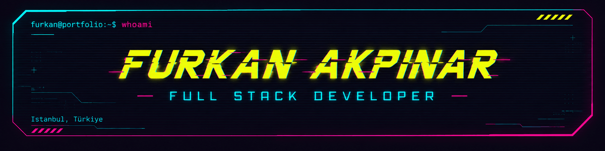

<p align="center">
  
</p>

# Furkan Akpınar

### Front-End Developer & Web Designer

I design and build modern, responsive and visually refined websites with a strong focus on typography, interaction, usability and high-end digital presentation.

My portfolio focuses on creating distinctive web experiences rather than generic templates — combining creative direction with clean front-end development.

---

## About Me

- Front-End Developer & Web Designer
- Focused on premium, responsive and interactive websites
- Strong interest in editorial layouts, visual storytelling and UI engineering
- Building production-ready projects with modern front-end technologies
- Continuously improving my React, TypeScript and Next.js workflow

---

## Tech Stack

### Frontend

`HTML5` · `CSS3` · `JavaScript` · `TypeScript` · `React` · `Next.js`

### Development & Deployment

`Git` · `GitHub` · `VS Code` · `Vercel` · `GitHub Pages`

### Design Focus

`Responsive Design` · `UI Engineering` · `Interaction Design` · `Creative Web Design` · `Accessibility`

---

## Featured Projects

### NOA MARE — Boutique Hotel

A cinematic and editorial boutique hotel website built as a fictional premium hospitality concept.

The project combines oversized typography, immersive photography, responsive compositions and refined interaction design.

**Tech:** Next.js · React · TypeScript · CSS

[Live Website](https://noa-mare-boutique-hotel.vercel.app) · [Repository](https://github.com/furkan-akpinar/noa-mare-boutique-hotel)

---

### Ezo Eylül Sağır — Interior Architecture

Interactive multi-page interior architecture portfolio designed around architectural visualization, project galleries and immersive presentation.

**Tech:** HTML5 · CSS3 · JavaScript

[Live Website](https://furkan-akpinar.github.io/ezo-eylul-sagir-interactive/) · [Repository](https://github.com/furkan-akpinar/ezo-eylul-sagir-interactive)

---

## What I Build

I am currently expanding my portfolio with a curated collection of high-quality websites across different industries.

The focus is on:

- Luxury hospitality websites
- Architecture & interior design portfolios
- Premium real estate experiences
- Automotive websites
- Creative agency websites
- Fashion & lifestyle brands
- Restaurant & hospitality concepts
- Construction & architecture companies
- Travel experiences
- Technology brands

Each project is designed with its own visual identity, layout system and interaction language.

---

## Current Focus

```text
Creative Front-End Development
Premium Web Design
Responsive Interfaces
Interactive Experiences
Next.js & React
TypeScript
Performance & Accessibility
```

## Development Approach

My projects are developed around four core principles:

Design

Strong typography, composition and visual hierarchy.

Interaction

Purposeful motion and user experience rather than unnecessary effects.

Responsive Design

Layouts designed specifically for desktop, tablet and mobile experiences.

Code Quality

Clean project structure, reusable architecture and production-ready builds.

## Portfolio Direction

The goal is to build a focused portfolio of distinctive, production-ready websites that demonstrate both visual design ability and front-end development skills.

Current portfolio expansion: 02 / 10 projects completed

## GitHub

You can explore my repositories to view source code, project documentation and live deployments.

github.com/furkan-akpinar
