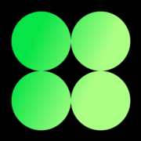
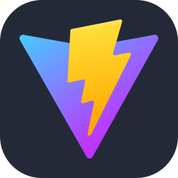
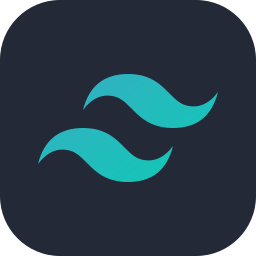

  <picture>
    <source media="(prefers-color-scheme: dark)" srcset="https://raw.githubusercontent.com/furkan-akpinar/furkan-akpinar/f2838cf3c0649c79e46c331f449f8e0e2bc1f65a/github-header-animated.gif">
    <source media="(prefers-color-scheme: light)" srcset="https://raw.githubusercontent.com/furkan-akpinar/furkan-akpinar/706e48b7de7623247a2a32d216de4ea1c5c4b5dd/assets/github-header-light.gif">
    
  </picture>

<h1 align="center">
  <picture>
    <source media="(prefers-color-scheme: dark)" srcset="https://raw.githubusercontent.com/furkan-akpinar/furkan-akpinar/f9ba239e244a1fd47bb96fc84b44fe7b64ca1563/assets/heading-role-samurai.gif">
    <source media="(prefers-color-scheme: light)" srcset="https://raw.githubusercontent.com/furkan-akpinar/furkan-akpinar/706e48b7de7623247a2a32d216de4ea1c5c4b5dd/assets/heading-role-samurai-light.gif">
    
  </picture>
</h1>

<h2 align="center">
  <picture>
    <source media="(prefers-color-scheme: dark)" srcset="https://raw.githubusercontent.com/furkan-akpinar/furkan-akpinar/abcb8dd7806fb73285ea32e2e89082f4f97d215f/assets/heading-about.svg">
    <source media="(prefers-color-scheme: light)" srcset="https://raw.githubusercontent.com/furkan-akpinar/furkan-akpinar/706e48b7de7623247a2a32d216de4ea1c5c4b5dd/assets/heading-about-light.svg">
    
  </picture>
</h2>

  Ben Furkan Akpınar; <strong>web tasarımı ve ön yüz geliştirme</strong> becerilerini bir araya getirerek markalara özgü dijital deneyimler oluşturuyorum.
  HTML, CSS, JavaScript ve TypeScript temelimle <strong>React ve Next.js üzerinde yeniden kullanılabilir, bakımı kolay arayüzler</strong> geliştiriyorum.
  Tipografi, görsel hiyerarşi ve etkileşim tasarımını; mobil, tablet ve masaüstünde tutarlı çalışan kullanıcı deneyimlerine dönüştürüyorum.
  Çok sayfalı portföyler, filtrelenebilir kataloglar, karşılaştırma ekranları ve çok adımlı formlar gibi farklı ihtiyaçlara yönelik çözümler üretiyorum.
  <strong>Erişilebilirlik, performans ve test</strong> konularını geliştirme sürecine dahil ediyor, temel kullanıcı akışlarını tarayıcı kontrolleri ve uygun projelerde Playwright ile doğruluyorum.
  Git ve GitHub ile sürüm kontrolünden Cloudflare Workers, Vercel ve GitHub Pages üzerinde yayına kadar projenin uygulama sürecini yürütüyorum.

  
  &nbsp;
  
  &nbsp;
  
  &nbsp;
  
  &nbsp;
  
  &nbsp;
  

 

<h2 align="center">
  <picture>
    <source media="(prefers-color-scheme: dark)" srcset="https://raw.githubusercontent.com/furkan-akpinar/furkan-akpinar/abcb8dd7806fb73285ea32e2e89082f4f97d215f/assets/heading-technologies.svg">
    <source media="(prefers-color-scheme: light)" srcset="https://raw.githubusercontent.com/furkan-akpinar/furkan-akpinar/706e48b7de7623247a2a32d216de4ea1c5c4b5dd/assets/heading-technologies-light.svg">
    
  </picture>
</h2>

Fikirden arayüze, geliştirmeden yayına.

<table align="center" width="100%">
  <tbody>
    <tr>
      <td width="33%" valign="top">
        <h3 align="center">Front-End Geliştirme</h3>
        

          <picture>
    <source media="(prefers-color-scheme: dark)" srcset="https://skillicons.dev/icons?i=html%2Ccss%2Cjs%2Cts&amp;theme=dark">
    <source media="(prefers-color-scheme: light)" srcset="https://skillicons.dev/icons?i=html%2Ccss%2Cjs%2Cts&amp;theme=light">
    
  </picture>
        

        
HTML5 &nbsp; · &nbsp; CSS3 JavaScript &nbsp; · &nbsp; TypeScript

        

          <picture>
    <source media="(prefers-color-scheme: dark)" srcset="https://skillicons.dev/icons?i=react%2Cnextjs%2Cvite%2Ctailwind&amp;theme=dark">
    <source media="(prefers-color-scheme: light)" srcset="https://skillicons.dev/icons?i=react%2Cnextjs%2Cvite%2Ctailwind&amp;theme=light">
    
  </picture>
        

        
React &nbsp; · &nbsp; Next.js Vite &nbsp; · &nbsp; Tailwind CSS

      </td>
      <td width="34%" valign="top">
        <h3 align="center">Back-End Geliştirme</h3>
        

          <picture>
    <source media="(prefers-color-scheme: dark)" srcset="https://skillicons.dev/icons?i=ts%2Cnodejs&amp;theme=dark">
    <source media="(prefers-color-scheme: light)" srcset="https://skillicons.dev/icons?i=ts%2Cnodejs&amp;theme=light">
    
  </picture>
        

        
TypeScript &nbsp; · &nbsp; JavaScript Node.js

        

          <picture>
    <source media="(prefers-color-scheme: dark)" srcset="https://skillicons.dev/icons?i=express%2Cpostgres&amp;theme=dark">
    <source media="(prefers-color-scheme: light)" srcset="https://skillicons.dev/icons?i=express%2Cpostgres&amp;theme=light">
    
  </picture>
        

        
Express PostgreSQL &nbsp; · &nbsp; SQL

        
Yeni projeler için planlanan teknoloji seti.

      </td>
      <td width="33%" valign="top">
        <h3 align="center">Geliştirme ve Yayınlama</h3>
        

          <picture>
    <source media="(prefers-color-scheme: dark)" srcset="https://skillicons.dev/icons?i=git%2Cgithub%2Cvscode&amp;theme=dark">
    <source media="(prefers-color-scheme: light)" srcset="https://skillicons.dev/icons?i=git%2Cgithub%2Cvscode&amp;theme=light">
    
  </picture>
        

        
Git &nbsp; · &nbsp; GitHub Visual Studio Code

        

          <picture>
    <source media="(prefers-color-scheme: dark)" srcset="https://skillicons.dev/icons?i=githubactions%2Cvercel%2Ccloudflare&amp;theme=dark">
    <source media="(prefers-color-scheme: light)" srcset="https://skillicons.dev/icons?i=githubactions%2Cvercel%2Ccloudflare&amp;theme=light">
    
  </picture>
        

        
GitHub Actions &nbsp; · &nbsp; Vercel Cloudflare Workers

        
Statik projeler için GitHub Pages de kullanıyorum.

      </td>
    </tr>
  </tbody>
</table>

 

<h2 align="center">
  <picture>
    <source media="(prefers-color-scheme: dark)" srcset="https://raw.githubusercontent.com/furkan-akpinar/furkan-akpinar/abcb8dd7806fb73285ea32e2e89082f4f97d215f/assets/heading-projects.svg">
    <source media="(prefers-color-scheme: light)" srcset="https://raw.githubusercontent.com/furkan-akpinar/furkan-akpinar/706e48b7de7623247a2a32d216de4ea1c5c4b5dd/assets/heading-projects-light.svg">
    
  </picture>
</h2>

Farklı sektörler için tasarladığım ve geliştirdiğim web deneyimleri.

<table align="center" width="100%">
  <tbody>
    <tr>
      <td width="100%" valign="top">
        <h3 align="left">Furkan Akpınar · CRT Portföy</h3>
        

          CRT ekran estetiği, WebGPU destekli 3D sahneler ve kaydırmaya bağlı sinematik geçişlerle projelerimi sunduğum etkileşimli kişisel portföy. 
          <picture>
            <source media="(prefers-color-scheme: dark)" srcset="https://skillicons.dev/icons?i=nextjs&amp;theme=dark">
            <source media="(prefers-color-scheme: light)" srcset="https://skillicons.dev/icons?i=nextjs&amp;theme=light">
            
          </picture>
          
          
          <picture>
            <source media="(prefers-color-scheme: dark)" srcset="https://skillicons.dev/icons?i=threejs&amp;theme=dark">
            <source media="(prefers-color-scheme: light)" srcset="https://skillicons.dev/icons?i=threejs&amp;theme=light">
            
          </picture>
          
          
          
          
          &nbsp; · &nbsp;
          <a href="https://github.com/furkan-akpinar/furkan-akpinar-crt-portfolio"><strong>Kaynak kod</strong></a>
          &nbsp; · &nbsp;
          <a href="https://furkanakpinar.dev/"><strong>Canlı demo ↗</strong></a>
          &nbsp; · &nbsp;
          Yayın: Cloudflare Workers
        

      </td>
    </tr>
    <tr>
  <td width="100%" valign="top">
    <h3 align="left">KARAKTER STÜDYO</h3>
    

      Etkileşimli tipografi, filtrelenebilir projeler, 2.5D stüdyo odası ve brief oluşturma formuyla illüstrasyon portföyü. 
      
      
      
      
      
      <picture>
    <source media="(prefers-color-scheme: dark)" srcset="https://raw.githubusercontent.com/tandpfun/skill-icons/main/icons/Vitest-Dark.svg">
    <source media="(prefers-color-scheme: light)" srcset="https://raw.githubusercontent.com/tandpfun/skill-icons/main/icons/Vitest-Light.svg">
    
  </picture>
      
      &nbsp; · &nbsp;
      <a href="https://github.com/furkan-akpinar/karakter-studyo"><strong>Kaynak kod</strong></a>
      &nbsp; · &nbsp;
      <a href="https://karakter-studyo.furkan-akpinar.workers.dev/"><strong>Canlı demo ↗</strong></a>
      &nbsp; · &nbsp;
      Yayın: Cloudflare Workers
    

  </td>
</tr>
    <tr>
      <td width="100%" valign="top">
        <h3 align="left">KIPIR</h3>
        

          Hareketli tipografi, 3D video galerisi ve çok adımlı brief formuyla 15 sayfalık yaratıcı stüdyo portföyü. 
          
          
          
          
          
          
          &nbsp; · &nbsp;
          <a href="https://github.com/furkan-akpinar/kipir-studio"><strong>Kaynak kod</strong></a>
          &nbsp; · &nbsp;
          <a href="https://kipir-studio.furkan-akpinar.workers.dev"><strong>Canlı demo ↗</strong></a>
          &nbsp; · &nbsp;
          Yayın: Cloudflare Workers
        

      </td>
    </tr>
    <tr>
      <td width="100%" valign="top">
        <h3 align="left">Snow Medya</h3>
        

          Sinematik açılış, video seçkisi ve ekrana uyumlu medya kullanımıyla kişisel kayak çekimi konseptini anlatan portföy sitesi. 
          
          
          
          
          
          
          &nbsp; · &nbsp;
          <a href="https://github.com/furkan-akpinar/snow-medya"><strong>Kaynak kod</strong></a>
          &nbsp; · &nbsp;
          <a href="https://snow-medya.furkan-akpinar.workers.dev/"><strong>Canlı demo ↗</strong></a>
          &nbsp; · &nbsp;
          Yayın: Cloudflare Workers
        

      </td>
    </tr>
    <tr>
      <td width="100%" valign="top">
        <h3 align="left">Furkan Akpınar · Dijital Ajans</h3>
        

          Hizmet detaylarını ve portföy çalışmalarını bir araya getiren, erişilebilir etkileşimler ve tarayıcı testleri içeren 13 sayfalık web sitesi. 
          
          
          
          
          
          
          
          &nbsp; · &nbsp;
          <a href="https://github.com/furkan-akpinar/furkan-akpinar-dijital-ajans"><strong>Kaynak kod</strong></a>
          &nbsp; · &nbsp;
          <a href="https://furkan-akpinar-dijital-ajans.furkan-akpinar.workers.dev"><strong>Canlı demo ↗</strong></a>
          &nbsp; · &nbsp;
          Yayın: Cloudflare Workers
        

      </td>
    </tr>
    <tr>
      <td width="100%" valign="top">
        <h3 align="left">VANTA DRIVE</h3>
        

          20 araçlık katalog, filtreleme, favoriler, karşılaştırma ve dört adımlı rezervasyon akışı içeren araç kiralama portföy demosu. 
          
          
          
          
          
          
          
          &nbsp; · &nbsp;
          <a href="https://github.com/furkan-akpinar/vanta-drive"><strong>Kaynak kod</strong></a>
          &nbsp; · &nbsp;
          <a href="https://vanta-drive.furkan-akpinar.workers.dev"><strong>Canlı demo ↗</strong></a>
          &nbsp; · &nbsp;
          Yayın: Cloudflare Workers
        

      </td>
    </tr>
    <tr>
      <td width="100%" valign="top">
        <h3 align="left">Ezo Eylül Sağır</h3>
        

          Proje galerileri, detay sayfaları ve gündüz / gece karşılaştırmalarıyla mimari görselleştirmeleri sunan etkileşimli iç mimarlık portföyü. 
          
          
          
          &nbsp; · &nbsp;
          <a href="https://github.com/furkan-akpinar/ezo-eylul-sagir-interactive"><strong>Kaynak kod</strong></a>
          &nbsp; · &nbsp;
          <a href="https://furkan-akpinar.github.io/ezo-eylul-sagir-interactive/"><strong>Canlı demo ↗</strong></a>
          &nbsp; · &nbsp;
          Yayın: GitHub Pages
        

      </td>
    </tr>
  </tbody>
</table>

 

<h2 align="center">
  <picture>
    <source media="(prefers-color-scheme: dark)" srcset="https://raw.githubusercontent.com/furkan-akpinar/furkan-akpinar/abcb8dd7806fb73285ea32e2e89082f4f97d215f/assets/heading-backend.svg">
    <source media="(prefers-color-scheme: light)" srcset="https://raw.githubusercontent.com/furkan-akpinar/furkan-akpinar/706e48b7de7623247a2a32d216de4ea1c5c4b5dd/assets/heading-backend-light.svg">
    
  </picture>
</h2>

Planlama süreci devam eden yeni yönetim uygulamalarım.

<table align="center" width="100%">
  <tbody>
    <tr>
      <td width="100%" valign="top">
        <h3 align="left">01 · Randevu ve İşletme Yönetimi</h3>
        
<strong>Devam ediyor...</strong> &nbsp; · &nbsp; Planlama aşamasında. Randevu takvimi, müşteri kayıtları ve işletme süreçlerini tek panelde birleştirmeyi hedefleyen yönetim uygulaması.

        

          <picture>
    <source media="(prefers-color-scheme: dark)" srcset="https://skillicons.dev/icons?i=ts%2Cnodejs%2Cexpress%2Cpostgres&amp;theme=dark">
    <source media="(prefers-color-scheme: light)" srcset="https://skillicons.dev/icons?i=ts%2Cnodejs%2Cexpress%2Cpostgres&amp;theme=light">
    
  </picture> 
          <strong>Planlanan diller:</strong> TypeScript / JavaScript &nbsp; · &nbsp; SQL 
          <strong>Planlanan altyapı:</strong> Node.js &nbsp; · &nbsp; Express &nbsp; · &nbsp; PostgreSQL
        

      </td>
    </tr>
    <tr>
      <td width="100%" valign="top">
        <h3 align="left">02 · Kurye ve Teslimat Yönetimi</h3>
        
<strong>Devam ediyor...</strong> &nbsp; · &nbsp; Planlama aşamasında. Teslimat talepleri, kurye ataması ve teslimat durumlarının takibini bir araya getirmeyi hedefleyen yönetim uygulaması.

        

          <picture>
    <source media="(prefers-color-scheme: dark)" srcset="https://skillicons.dev/icons?i=ts%2Cnodejs%2Cexpress%2Cpostgres&amp;theme=dark">
    <source media="(prefers-color-scheme: light)" srcset="https://skillicons.dev/icons?i=ts%2Cnodejs%2Cexpress%2Cpostgres&amp;theme=light">
    
  </picture> 
          <strong>Planlanan diller:</strong> TypeScript / JavaScript &nbsp; · &nbsp; SQL 
          <strong>Planlanan altyapı:</strong> Node.js &nbsp; · &nbsp; Express &nbsp; · &nbsp; PostgreSQL
        

      </td>
    </tr>
  </tbody>
</table>

Kaynak kod, canlı demo ve ayrıntılı proje bilgileri yayınlandıktan sonra eklenecek.

 

  

